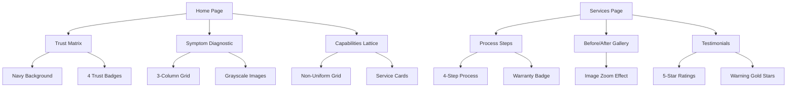

# TrueRoof UI Implementation Plan

## Overview
Implement the TrueRoof color scheme and UI enhancements to create a professional, "engineered" roofing website with high visual density and strong trust signals.

## 1. Color Scheme Updates

### CSS Tokens (`css/tokens.css`)
| Token | Current | New Value | Usage |
|-------|---------|-----------|-------|
| `--orange` | `#ff6b35` | `#D84315` | CTAs, Action color |
| `--navy` | `#0a1628` | Keep as-is | Primary, Headers, Footers |
| `--slate` | N/A | `#475569` | Borders, Sub-text |
| `--gold` | N/A | `#FFB100` | Star ratings, Badges |

### Usage Mapping
- **Navy (#0A1628)**: Headers, Footers, dark-mode sections
- **Safety Orange (#D84315)**: CTAs only, status badges
- **Slate (#475569)**: Borders, sub-text elements
- **Warning Gold (#FFB100)**: Star ratings, "Dulux Accredited" badges

## 2. Typography

### Font Import
```html
<link rel="preconnect" href="https://fonts.googleapis.com">
<link rel="preconnect" href="https://fonts.gstatic.com" crossorigin>
<link href="https://fonts.googleapis.com/css2?family=Plus+Jakarta+Sans:wght@400;500;600;700&display=swap" rel="stylesheet">
```

### Typography Rules
- **Body**: Plus Jakarta Sans (Sans-serif)
- **Headlines**: Georgia (Serif) - "Legacy Firm" contrast

## 3. UI Components

### A. Trust Matrix (Social Proof Bar)
**Current**: Light gray background
**Update**: Navy background (`#0A1628`), 4-column layout

```css
.trust-strip {
  background: var(--navy);
  border-top: 4px solid var(--orange);
  border-bottom: none;
  padding: var(--space-10) 0;
}
```

### B. Symptom Diagnostic (Grid)
**Updates**:
- 3-column grid on desktop (forced)
- Grayscale images that turn to color on hover
- 2px thick borders for "engineered" feel

```css
.symptoms-grid {
  grid-template-columns: repeat(3, 1fr);
}

.symptom-card {
  border: 2px solid var(--slate);
  transition: transform 0.2s ease-in-out;
}

.symptom-card:hover {
  border-color: var(--orange);
  transform: translateY(-5px);
}

.symptom-image {
  filter: grayscale(100%);
  transition: filter 0.3s ease;
}

.symptom-image:hover {
  filter: grayscale(0%);
}
```

### C. Capabilities Lattice (Bento Grid)
**Updates**:
- Non-uniform grid layout
- Service icons with custom styling
- Cards spanning different sizes

```css
.cards-grid {
  display: grid;
  grid-template-columns: repeat(4, 1fr);
  grid-template-rows: repeat(2, auto);
  gap: var(--space-4);
}

.card {
  border: 2px solid var(--slate);
}

.card:nth-child(1) { grid-column: span 2; }
.card:nth-child(2) { grid-row: span 2; }
```

### D. Micro-Interactions

#### Shimmer Effect on Buttons
```css
.btn-primary::before {
  content: '';
  position: absolute;
  top: 0;
  left: -100%;
  width: 100%;
  height: 100%;
  background: linear-gradient(90deg, transparent, rgba(255,255,255,0.2), transparent);
  animation: shimmer 3s infinite;
}

@keyframes shimmer {
  0% { left: -100%; }
  100% { left: 100%; }
}
```

#### Zoom on Gallery Images
```css
.gallery-image-item {
  overflow: hidden;
}

.gallery-image-item:hover img {
  transform: scale(1.05);
}

.gallery-image-item img {
  transition: transform 0.3s ease;
}
```

## 4. Visual Density Improvements

### Text Constraint
```css
.container-narrow {
  max-width: 800px;
  margin: 0 auto;
}

.text-content {
  max-width: 800px;
}
```

### Edge-to-Edge Backgrounds
```css
.section-full-bleed {
  width: 100%;
}

.section-full-bleed .container {
  max-width: var(--container-max);
}
```

## 5. Implementation Order

1. **Phase 1**: CSS Tokens & Typography
   - Update `css/tokens.css` with new colors
   - Add Plus Jakarta Sans to `index.html`

2. **Phase 2**: Visual Density & Borders
   - Update border styles (2px thick)
   - Add max-width constraints to text

3. **Phase 3**: Trust Matrix Enhancement
   - Change background to Navy
   - Add orange top border

4. **Phase 4**: Symptom Grid Updates
   - Force 3-column layout
   - Add grayscale-to-color effect

5. **Phase 5**: Micro-Interactions
   - Shimmer on CTAs
   - Zoom on gallery

6. **Phase 6**: Capabilities Lattice
   - Non-uniform grid styling
   - Card enhancements

## Files to Modify

| File | Changes |
|------|---------|
| `css/tokens.css` | Add `--slate`, `--gold`, update `--orange` |
| `css/sections.css` | Borders, grid layouts, animations |
| `index.html` | Font import, section enhancements |

## Mermaid: Component Architecture



---

**Status**: Ready for implementation  
**Mode Switch**: Code mode required
